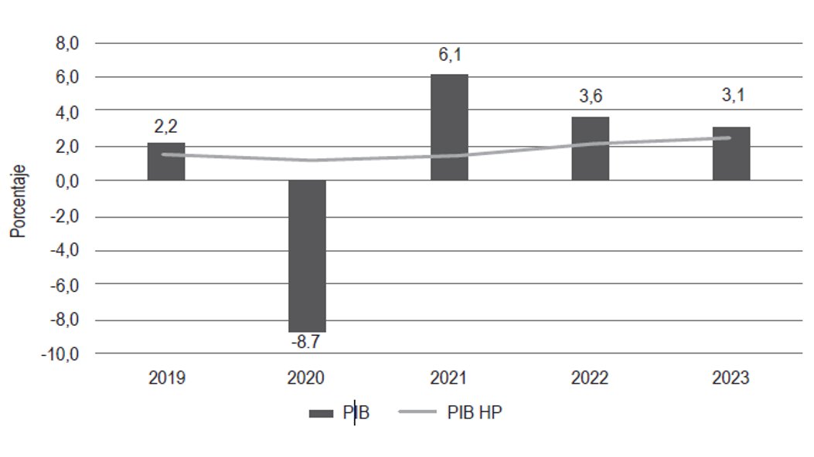
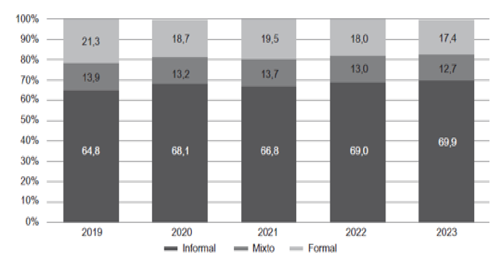

\newpage

## 1. **Introduccion:**

El microcrédito ha emergido como una herramienta fundamental para la inclusión financiera en Bolivia, especialmente en un contexto donde las instituciones financieras de desarrollo juegan un papel crucial en el empoderamiento de sectores vulnerables. A medida que el país enfrenta desafíos económicos, como el aumento del desempleo y la precarización laboral, el acceso a microcréditos se convierte en un recurso vital para fomentar la estabilidad económica de los prestatarios y promover el desarrollo sostenible. Este estudio se centra en el comportamiento de la cartera de microcréditos de la Institución Financiera de Desarrollo CIDRE IFD en las ciudades de La Paz y Oruro, analizando su evolución en relación con factores económicos entre 2022 y 2024, con el objetivo de identificar estrategias que fortalezcan su impacto y mitiguen los riesgos asociados.

## 2. **Antecedentes:**

Las instituciones financieras de desarrollo (IFD) en Bolivia han jugado un papel esencial en la inclusión financiera, acercando servicios y productos financieros a los sectores más vulnerables de la sociedad. Estas instituciones no solo contribuyen al empoderamiento económico de individuos y comunidades, sino que también se convierten en motores para el desarrollo local y la reducción de desigualdades. En este contexto, CIDRE IFD se destaca como una entidad comprometida con el fomento del acceso al microcrédito, permitiendo a pequeños productores, emprendedores y familias contar con el financiamiento necesario para llevar a cabo sus proyectos y mejorar sus condiciones de vida. Sin embargo, la gestión de la cartera de microcrédito no está exenta de desafíos. CIDRE IFD ha enfrentado fluctuaciones económicas y contextos complejos en las ciudades de La Paz y Oruro, regiones donde opera con gran intensidad. Este estudio busca analizar los factores económicos que han influido en el comportamiento de esta cartera entre 2022 y 2024. Al comprender estas dinámicas, se espera aportar recomendaciones prácticas para mejorar la resiliencia de CIDRE IFD y potenciar su impacto en la promoción de la inclusión financiera en Bolivia.

## 3. **Motivacion:**

Para una Institución Financiera de Desarrollo como CIDRE (estudio de caso) la cartera de préstamos se constituye en la proporción más importante del activo y, por tanto, la principal fuente de sus ingresos. Pero cuando el entorno económico y social de un pais en este caso en Bolivia presenta cambios que inciden en la economía de la población económicamente activa, sin duda, puede incidir negativamente en el comportamiento regular de la cartera

El analizar la data del negocio principal de una Institución Financiera de Desarrollo como es el estudio de caso CIDRE IFD me permite determinar la incidencia de la economía en Bolivia en un negocio que aporta al desarrollo de las unidades económicas microempresariales de las ciudades de La Paz y Oruro.

## 4. **Pregunta de investigación:**

¿Cuál es la incidencia de los factores económicos de los periodos 2022 al 2024 en Bolivia, en el comportamiento de la cartera de microcrédito en una Institución Financiera de Desarrollo de las ciudades de La Paz y Oruro? (caso CIDRE IFD)

## 5. **Objetivos:**

**4.1. Objetivo General:**

Analizar la incidencia de los factores económicos en el comportamiento de la cartera de microcréditos de CIDRE IFD en las ciudades de La Paz y Oruro durante los periodos 2022-2024.

**4.2. Objetivos Específicos:**

\- Evaluar el impacto de las fluctuaciones macroeconómicas bolivianas en la cartera de microcréditos

-   Identificar la relación entre el empleo informal y la morosidad crediticia

-   Proponer estrategias de gestión de cartera adaptadas al contexto económico boliviano

## 6. **Revision de la literatura:**

**6.1 La economía en Bolivia: Un análisis crítico post-pandemia 2022-2024**

De acuerdo con el "Informe del Milenio sobre la economía en Bolivia" (2023-2024), tras la pandemia del COVID-19, la economía boliviana mostró una tendencia positiva con un crecimiento del 6.11% en 2022. Sin embargo, este crecimiento se desaceleró a 3.6% en 2023, y para 2024 el INE publicó un crecimiento de solo 2.14%. Esta tendencia decreciente refleja una crisis inminente manifestada por la escasez de divisas y combustibles, agudizando "...los desequilibrios fiscales, monetarios, cambiarios y financieros, que conllevan riesgos para la estabilidad macroeconómica" (Informe Nuevo Milenio, 2024, pág. 7).

```{r i1, out.width = "100%", echo = FALSE, fig.cap="Crecimiento trimestral del PIB en 2022 y 2023 (variación porcentual)", fig.align='center', fig.env='figure'}


```

Otro factor que amerita una valoración en medida que condice con el tema de investigación propuesto, es analizar el mercado laboral en nuestro país, de acuerdo al “Informe del Milenio sobre la economía en Bolivia” 2023 y 2024, exponen que la tasa de desempleo es alta y que es producto de un problema que deviene del denominado “precarización” manifestado en el increíble crecimiento del “cuentapropismo”; un tipo de trabajo predominantemente informal, desamparada y casi siempre mal remunerada y con propensión a predominar. el 70% de los hogares urbanos del país se encuentran en situación de ocupación informal (gráfico No 2). El aumento de la actividad “informal” está demostrando que las oportunidades de un empleo formal son menores y que la opción para generar ingresos se concentra en la formación de economías alternas, a través de actividades diversas, sobre todo de comercio, servicio, etc.

Gráfico No 2 **Hogares según mercado laboral (en porcentaje, sobre el total de la población urbana)**

```{r i2, out.width = "80%", echo = FALSE, fig.cap="Hogares según mercado laboral (en porcentaje, sobre el total de la población urbana)", fig.align='center', fig.env='figure'}

```

Fuente: “Informe del Milenio sobre la economía en Bolivia” 2024

En Bolivia, las microempresas representan un segmento importante del mercado, especialmente en las ciudades capitales. Aunque muchas operan de manera informal y generan ingresos limitados, son fundamentales para el ecosistema financiero, en particular el sector de microfinanzas.

Según la Fundación ARU y el Ministerio de Desarrollo Productivo y Economía Plural (MDPyEP), las micro y pequeñas empresas (MyPE) se identifican por tres criterios: **ventas anuales, patrimonio y número de empleados**. La OIT establece que una microempresa tiene entre **2 y 9 empleados**, mientras que una pequeña cuenta con **10 a 49**. El INE maneja distintos rangos según el sector económico: en manufactura, una microempresa tiene **hasta 10 empleados** y una pequeña hasta **30**; en comercio y servicios, una microempresa opera con **hasta 5 empleados** y una pequeña con **hasta 20**.

Las microempresas requieren financiamiento para su crecimiento, pero enfrentan barreras de acceso al crédito debido a factores externos (como condiciones de mercado) e internos (como la falta de información financiera adecuada). Esto genera **exclusión financiera**, dificultando su desarrollo y sostenibilidad económica.

**6.2 LAS MICROFINANZAS: ENFOQUE HACIA SECTORES INFORMALES (MICRO Y PEQUEÑAS EMPRESA.**

Un artículo publicado en ABC Economía (2024) exploró el comportamiento de la cartera de créditos en Bolivia y su relación con el microcrédito. El estudio señala que, a lo largo de las últimas décadas, la expansión del microcrédito ha desempeñado un papel crucial en la inclusión financiera de sectores tradicionalmente marginados. Sin embargo, también destaca los desafíos asociados, como el riesgo de morosidad y la necesidad de diseñar políticas adecuadas para garantizar la sostenibilidad del sector financiero. Utilizando datos recientes, el artículo analiza la evolución del microcrédito en relación con la estabilidad macroeconómica del país.

Un estudio de la Fundación ARU (2024) evaluó el impacto del microcrédito en Bolivia, con evidencia del crédito productivo individual otorgado por el Banco de Desarrollo Productivo (BDP). Los investigadores encontraron que el acceso al microcrédito ha impulsado el crecimiento de pequeños emprendimientos, mejorando sus ingresos y estabilidad económica. Sin embargo, el estudio también señala que el efecto del crédito varía dependiendo de la estructura del negocio y la capacitación financiera del prestatario. Además, se destaca que los programas de financiamiento deben estar acompañados de asistencia técnica para maximizar su impacto en la productividad y sostenibilidad de los emprendimientos.

El estudio del microcrédito en Bolivia permite comprender su papel como una herramienta de inclusión financiera y su influencia en la estabilidad económica de los prestatarios. Identificar los factores que afectan el comportamiento de la cartera de microcréditos es crucial para diseñar estrategias que fortalezcan su impacto y mitiguen riesgos asociados, promoviendo así un desarrollo financiero más equitativo y sostenible.

## 7 **Descripcion de los datos:**

El presente estudio utiliza un subconjunto de datos extraído de la base de cartera de créditos de una entidad financiera. Este subconjunto se compone de variables que permiten describir las características básicas del cliente y las condiciones del crédito otorgado. En cuanto al perfil del cliente, se consideran las variables edad, sexo y sector geográfico (rural o urbano). Estas permiten analizar diferencias de comportamiento crediticio según género, grupo etario y ubicación. Por otro lado, en el ámbito crediticio, se seleccionan variables clave como el monto del crédito, la tasa de interés aplicada, los días en mora (como indicador de incumplimiento) y la calificación crediticia. Estas variables permitirán explorar patrones asociados al riesgo de incumplimiento y construir modelos predictivos en el marco de la minería de datos.

Variables de caracterización del cliente: - Edad - Sexo - Sector geográfico: urbano o rural Variables crediticias: - Monto aprobado del crédito - Tasa de interés - Días en mora - Calificación crediticia (A, B, C, D, E)

## **8. Justificación del Dataset Nacional**

El dataset sobre la cartera de microcréditos de CIDRE IFD en La Paz y Oruro se justifica dentro del contexto de una problemática clave en Bolivia: la **inclusión financiera** y la **sostenibilidad de las microempresas** frente a la desaceleración económica.

**Conexión con la Problemática Local**

La economía boliviana ha mostrado una tendencia decreciente desde 2022, con una reducción en el crecimiento del PIB y un aumento en la informalidad laboral. En este escenario, las **microempresas** y los **emprendedores** enfrentan barreras estructurales para acceder a financiamiento, lo que puede afectar directamente la estabilidad del sistema financiero de desarrollo.

El dataset proporciona datos sobre clientes y su comportamiento crediticio, lo que permite:

1.  **Identificar patrones de acceso al crédito**, diferenciando entre sectores urbanos y rurales.

2.  **Evaluar el impacto de la economía nacional** en la capacidad de pago y tasas de mora.

3.  **Analizar la calificación crediticia** para entender los riesgos y diseñar estrategias de mitigación.

4.  **Optimizar la asignación de recursos** dentro de CIDRE IFD, ajustando políticas de financiamiento a las necesidades reales de los prestatarios.

## 9. **Metodologia aplicada:**

Metodología Esta investigación adopta un enfoque cuantitativo y predictivo, apoyado en técnicas de minería de datos, particularmente modelos de regresión, con el fin de analizar el comportamiento de la cartera de microcréditos de una Institución Financiera de Desarrollo (CIDRE IFD) en las ciudades de La Paz y Oruro durante los años 2022 al 2024.

1.  Base de datos y variables La información utilizada proviene de la base de datos interna de CIDRE IFD, la cual contiene registros de operaciones crediticias en las regiones mencionadas. A partir de este conjunto amplio de variables, se seleccionaron las siguientes:

Variables sociodemográficas:

Edad: variable cuantitativa continua.

Sexo: variable cualitativa binaria.

Sector rural/urbano: variable binaria.

Variables crediticias:

Monto aprobado: monto del crédito otorgado (cuantitativa).

Tasa de interés: tasa aplicada al crédito (cuantitativa).

Días en mora: número de días de incumplimiento en el pago (cuantitativa).

Calificación crediticia: clasificación del cliente según su comportamiento de pago (ordinal/categórica).

2.  Enfoque metodológico El análisis sigue la estructura planteada en el curso de regresión:

Paso 1: Preparación de los datos Limpieza de registros con valores faltantes o inconsistentes.

Transformación de variables categóricas en factores (por ejemplo, sexo y sector).

Generación de variables derivadas si es necesario (como categorías de edad o rangos de monto).

Paso 2: Relación de interés La variable dependiente principal es:

Días en mora, medida como una variable continua.

Se busca evaluar cómo las variables demográficas y crediticias influyen en esta.

Paso 3: Modelo de regresión Se define el siguiente modelo general: $$

\begin{align*}
\text{DiasMora}_i = \beta_0 
&+ \beta_1 \text{Edad}_i \\
&+ \beta_2 \text{Sexo}_i \\
&+ \beta_3 \text{Sector}_i \\
&+ \beta_4 \text{Monto}_i \\
&+ \beta_5 \text{TasaInteres}_i \\
&+ \beta_6 \text{Calificación}_i \\
&+ \epsilon_i
\end{align*}
$$

En una segunda etapa, se evalúa también una versión log-transformada de los días en mora si la distribución resulta altamente sesgada.

```{r, echo=FALSE, message=FALSE, warning=FALSE}
#Proyecto de mineria de datos 
rm(list = ls())
library(readxl)
library(dplyr)
library(tidyr)
library(stringr)
library(lubridate)
library(ggplot2)
library(forecast)
library(plotly)
library(readxl)
library(dplyr)
getwd()

# Cargar bases
bd_2022 <- read_excel("base cartera sucursal 2022 FINAL TODAS LAS AGENCIAS.XLSX") 
bd_2023 <- read_excel("CARTERA LPZ ORU 2023 (1).xlsx") 
bd_2024 <- read_excel("BASE 31-12-2024.xlsx")
# Unir las bases
bd_total <- bind_rows(bd_2022, bd_2023, bd_2024)

# Seleccionar columnas relevantes
bd_total <- bd_total %>%
  transmute(
    Edad = as.numeric(difftime(Sys.Date(), as.Date(`Fecha Nacimiento`), units = "days")) %/% 365,
    Sexo = as.factor(Sexo),
    Sector = as.factor(`Sector RURAL/URBANO`),
    Monto = as.numeric(`Monto Desembolsado`),
    Tasa = as.numeric(`Tasa de interes fija`),
    DiasMora = as.numeric(`Dias en mora`),
    Calificacion = as.factor(Calificacion)
  ) %>%
  select(Edad, Sexo, Sector, Monto, Tasa, DiasMora, Calificacion) %>%
  filter(!is.na(Edad) & !is.na(Sexo) & !is.na(Sector) & !is.na(Monto) & !is.na(Tasa) & !is.na(DiasMora) & !is.na(Calificacion))

  summary(bd_total)
#MODELO
modelo_log <- lm(log1p(DiasMora) ~ Edad + Sexo + Sector + Monto + Tasa + Calificacion, data = bd_total)
summary(modelo_log)

```

El modelo de regresión ajustado busca evaluar los determinantes de los días en mora de los clientes de CIDRE IFD, considerando una transformación logarítmica para estabilizar la variabilidad de la variable dependiente. Los resultados se presentan en términos de coeficientes estimados, significancia estadística y capacidad explicativa del modelo.

**1. Calidad y Significancia del Modelo** El coeficiente de determinación ajustado (R² = 0.8194) indica que aproximadamente 82% de la variabilidad en los días de mora puede ser explicada por las variables independientes incluidas en el análisis. Este nivel sugiere una relación robusta entre las características crediticias y el comportamiento de pago.

\-**El estadístico F** (7049, p \< 2.2e-16) confirma la alta significancia del modelo en su conjunto, lo que implica que al menos una de las variables explicativas tiene un efecto significativo sobre la mora.

**Interpretación de los Coeficientes** Los coeficientes de regresión reflejan el impacto relativo de cada variable sobre la cantidad de días en mora.

**-Edad** (p = 0.532): No se identifica un efecto estadísticamente significativo de la edad del cliente sobre la mora.

**-Sexo** (p = 0.681): La variable no muestra significancia, lo que sugiere que no existen diferencias sistemáticas entre hombres y mujeres respecto a su comportamiento de pago.

**-Sector geográfico** (p = 0.654): No se evidencia una relación estadística entre la localización del prestatario (urbano/rural) y los días en mora.

**Por otro lado, las siguientes variables presentan efectos significativos en la probabilidad de mora:**

**Monto aprobado del crédito** (p = 0.005): Aunque su coeficiente es pequeño (1.849e-07), indica que montos de crédito más elevados pueden estar asociados con un ligero aumento en los días de mora.

**Tasa de interés** (p = 0.000575): Un coeficiente positivo (2.867e-03) sugiere que tasas más altas incrementan los días en mora, reflejando la carga financiera adicional que enfrentan los prestatarios con créditos más costosos.

**Impacto de la Calificación Crediticia** La variable calificación crediticia es la que presenta un mayor efecto sobre la mora.

Clientes con calificación A sirven como grupo de referencia.

Clientes con calificación B, C, D, E y F muestran coeficientes crecientes, lo que indica que, a medida que disminuye la calificación, se incrementan significativamente los días en mora.

Calificación F (coeficiente = 6.488, p \< 2e-16) presenta la mayor incidencia en mora, lo que refleja un alto riesgo de incumplimiento en este segmento.

```{r graficos_ajustados, echo=FALSE, message=FALSE, warning=FALSE, fig.width=8, fig.height=5, fig.align='center', fig.cap=c("Número de Clientes por Calificación", "Crecimiento de Cartera por Año"), out.width='90%'}
#Graficas 
rm(list = ls())
library(lubridate)
library(dplyr)
library(ggplot2)
library(plotly)
library(scales)

# Cargar bases
bd_2022 <- read_excel("base cartera sucursal 2022 FINAL TODAS LAS AGENCIAS.XLSX") 
bd_2023 <- read_excel("CARTERA LPZ ORU 2023 (1).xlsx") 
bd_2024 <- read_excel("BASE 31-12-2024.xlsx")
# Unir las bases
bd_total <- bind_rows(bd_2022, bd_2023, bd_2024)
# Grafico
bd_total <- bd_total %>%
  mutate(`Fecha primer desembolso` = as.Date(`Fecha primer desembolso`, format = "%d/%m/%Y"),
         Año = year(`Fecha primer desembolso`))
crecimiento_cartera <- bd_total %>% 
  group_by(Año) %>%
  summarise(Total_Monto = sum(`Monto Desembolsado`, na.rm = TRUE))
p_crecimiento <- ggplot(crecimiento_cartera, aes(x = factor(Año), y = Total_Monto, group = 1)) +
  geom_line(color = "black", size = 1.5) +
  geom_point(color = "red", size = 3) +
  labs(title = "Crecimiento de Cartera por Año",
       x = "Año",
       y = "Monto Total Desembolsado (Bs)") +
  theme_minimal()
# Preparar datos: clientes únicos por calificación
clientes_calificacion <- bd_total %>% 
  distinct(`Nro. Cliente`, Calificacion) %>%
  group_by(Calificacion) %>%
  summarise(Numero_Clientes = n())

# Crear gráfico
p_clientes <- ggplot(clientes_calificacion, aes(x = Calificacion, y = Numero_Clientes, fill = Calificacion)) +
  geom_bar(stat = "identity") +
  labs(title = "Número de Clientes por Calificación",
       x = "Calificación",
       y = "Número de Clientes") +
  theme_minimal() +
  theme(legend.position = "none")

# Mostrar el gráfico
print(p_clientes)


# Mostrar el gráfico 
print(p_crecimiento)

```

**Interpretacion (Figura 3)** El gráfico muestra la distribución de clientes según su calificación crediticia dentro de CIDRE IFD. Se observan las siguientes tendencias clave:

Predominio de clientes con calificación A

La mayoría de los clientes tienen una calificación A, superando los 6,500 casos.

Esto sugiere que CIDRE IFD mantiene una cartera con predominancia de prestatarios confiables, lo que podría reflejar políticas crediticias estrictas para minimizar el riesgo de mora.

Reducción drástica en clientes con calificación B y menores

La cantidad de clientes con calificación B es significativamente menor, rondando los 500.

Las calificaciones C, D, E y F tienen valores marginales, indicando que CIDRE IFD concede pocos préstamos a prestatarios de alto riesgo o que la morosidad lleva a la exclusión progresiva de estos clientes.

Implicaciones para la gestión de riesgo crediticio

La alta concentración de clientes en categorías de bajo riesgo puede ser positiva en términos de estabilidad financiera, pero podría limitar el impacto de CIDRE IFD en la inclusión financiera de microempresas con acceso restringido al crédito.

La baja representación en las calificaciones inferiores podría reflejar una política conservadora de crédito, restringiendo el acceso a quienes presentan mayor riesgo de mora.

Evaluar estrategias de seguimiento y reestructuración de cartera para clientes con calificaciones intermedias (B y C) podría mejorar su permanencia en el sistema financiero.

**Interpretacion (Figura 4)** El gráfico presenta la evolución del Monto Total Desembolsado (Bs) en la cartera de CIDRE IFD desde 2012 hasta 2024. Se observan varias tendencias clave:

Crecimiento sostenido entre 2012 y 2019: Durante este período, el monto desembolsado muestra un incremento significativo, lo que sugiere una expansión en la colocación de créditos y una mayor confianza en el sistema financiero.

Caída en 2020: Esta disminución puede estar vinculada a los efectos de la pandemia del COVID-19, que impactó la economía y redujo la demanda de crédito, especialmente en microempresas.

Recuperación parcial en 2021 y 2022: La cartera muestra una recuperación, aunque no alcanza los niveles previos a la pandemia. Esto puede reflejar una estabilización del mercado y el retorno progresivo de la actividad económica.

Nueva contracción en 2023 y 2024: La tendencia descendente en estos años indica posibles dificultades económicas, menor demanda de financiamiento, o una política de crédito más cautelosa por parte de CIDRE IFD.

## 10. **Conclusiones:**

El análisis del comportamiento de la cartera de microcréditos de CIDRE IFD entre 2022 y 2024 evidencia una tendencia de desaceleración financiera impulsada por factores macroeconómicos y estructurales dentro del país. La caída del PIB, el incremento de la informalidad laboral y la escasez de divisas han generado condiciones de incertidumbre que afectan la colocación y recuperación de créditos, particularmente en sectores de microempresas y pequeños emprendedores.

El modelo de regresión confirma que la calificación crediticia es el factor de mayor impacto en la probabilidad de mora, mostrando una relación directa entre calificaciones bajas y el incumplimiento de pagos. Asimismo, la tasa de interés ejerce un efecto significativo en la acumulación de mora, lo que sugiere que un esquema de financiamiento con tasas diferenciadas podría reducir el riesgo de incumplimiento. En contraste, variables como edad, sexo y sector geográfico no presentan una influencia relevante en la morosidad, lo que indica que el comportamiento de pago está más ligado a factores financieros que demográficos.

Los gráficos de evolución del monto desembolsado reflejan un crecimiento sostenido hasta 2019, seguido de una contracción en 2020 debido a la pandemia de COVID-19. Si bien CIDRE IFD mostró una recuperación parcial en 2021 y 2022, la cartera volvió a disminuir en 2023 y 2024, reflejando una crisis estructural que afecta la demanda de crédito y la estabilidad financiera de los prestatarios.

## 11. Bibliografía

Fundación ABC Economía. (s.f.). La cartera de créditos y el microcrédito en Bolivia (1era parte). Recuperado de: <https://web.abceconomia.com/revista-n-95/la-cartera-de-creditos-y-el-microcredito-en-bolivia-1era-parte/>

Christen, R. P., & Rhyne, E. (s.f.). Bolivia: Los más pobres, los más atendidos. Microfinance.com. Recuperado de: <https://microfinance.com/Castellano/Documentos/Bolivia_los_mas_Pobres.pdf>

Los Tiempos. (2024, abril 22). Microcréditos en Bolivia ya llegan al 31% de la cartera de préstamos. Recuperado de: <https://www.lostiempos.com/actualidad/economia/20240422/microcreditos-bolivia-ya-llegan-al-31-del-cartera-prestamos>

Money Bolivia. (s.f.). Microcréditos representan el 30% de las colocaciones del sistema financiero. Recuperado de: <https://www.money.com.bo/ecofinanzas/microcreditos-representan-el-30-de-las-colocaciones-del-sistema-financiero/>

Fundación ARU. (s.f.). Evaluando el impacto de microcréditos en Bolivia: Evidencia del Crédito Productivo Individual (BDP). Recuperado de: <https://www.aru.org.bo/obs_desigualdad/doc/EvaluandoelImpactodeMicrocreditosenBolivia.EvidenciadelCr%C3%A9ditoProducitvoIndividual.BDP.pdf>

Fundación ARU. (2024, mayo). Empleo e ingresos de micro y pequeños productores del área rural en Bolivia. Recuperado de: <https://www.aru.org.bo/wp-content/uploads/2024/05/Bolivia_Empleo_e_ingresos_de_micro_y_pequenos_productores_del_area-1.pdf>

Fundación Milenio. (2024). Informe sobre la economía de Bolivia 2024 (N.º 46). Recuperado de: <https://fundacion-milenio.org/informe-de-milenio-sobre-la-economia-de-bolivia-2024-n-46/>

FINRURAL. (s.f.). Sitio oficial de FINRURAL. Recuperado de: <https://www.finrural.org.bo/>

CIDRE IFD. (s.f.). Nosotros – CIDRE IFD. Recuperado de: <https://cidre.org.bo/nosotros/>
